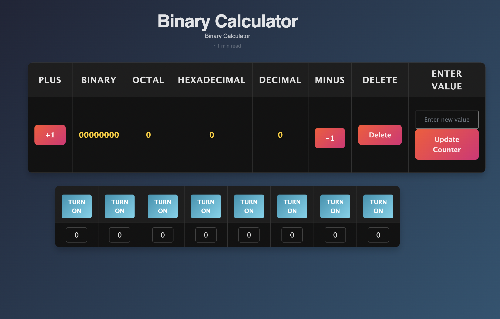

<body>
    <h1>Project Summary</h1>

        <h2>5/5 Points - 12 Week Progress Overview</h2>
        <button class="toggle-btn" onclick="toggleSection('progress')">See More</button>
        

            <h3>Five Things Accomplished</h3>
            <ul>
                <li>
                    <button class="toggle-btn" onclick="toggleSection('binaryCalcFrontend')">Binary Calculator Frontend</button>
                    

                        
Developing the Binary Calculator frontend allowed me to demonstrate my skills in web development, particularly in HTML, CSS, and JavaScript. By creating a user-friendly interface that accepts binary input and displays results, I was able to show that I can design interactive programs that meet user needs. It helped me understand the importance of user experience and the role it plays in the functionality of a program.

                        
                    

                </li>
                <li>
                    <button class="toggle-btn" onclick="toggleSection('binaryOverflow')">Binary Overflow</button>
                    

                        
Binary Overflow was a significant step in my development as a computer scientist, as it involved both frontend and backend programming. I worked on the feature's design, implemented a dynamic interface, and integrated it with a backend that stores and retrieves posts. This project matters for CSP because it required me to apply algorithms and data structures while solving real-world problems like data storage and user interaction. Building this feature helped me better understand how software can facilitate collaboration and problem-solving, which is central to the concepts covered in CSP.

                    

                </li>
                <li>
                    <button class="toggle-btn" onclick="toggleSection('frontendReviewSite')">Developed Stylish Frontend for Binary Review Site</button>
                    

                        
By developing the frontend for the Binary Review Site, I was able to apply design principles and improve my ability to create engaging, functional web pages. I learned how to implement responsive design to ensure that the site would work well on different devices. The collaboration I did with Shaurya was also essential in helping me grow. It helped me understand the impact of a well-designed frontend on user experience and the effectiveness of a website or application.

                        
                    

                </li>
                <li>
                    <button class="toggle-btn" onclick="toggleSection('binaryCalcBackend')">Developed Binary Calculator Backend</button>
                    

                    <a href="http://127.0.0.1:4100/Vincent_2025/snake">Binary Calc</a>
                    

                </li>
                <li>
                    <button class="toggle-btn" onclick="toggleSection('collaborationSkills')">Improved Collaboration Skills through 8-Person Group Project</button>
                    

                        
Working in an 8-person group was possibly the most difficult part of this class. I worked closely with others to divide tasks, share code, and integrate our work into a cohesive product. As software development often involves teams of people working together, the experience taught me how to communicate effectively, resolve conflicts, and ensure that everyone's contributions were integrated successfully, skills that are essential for any aspiring computer scientist.

                    

                </li>
            </ul>
        

    

        <h2>2/2 Points - Full Stack Project Demo</h2>
        <button class="toggle-btn" onclick="toggleSection('feedback')">See More</button>
        <h3>N@tM Feedback</h3>
    

        
<strong>1. Anu Herranen (Parent)</strong>

        
Positive: The website is well-structured and easy to navigate.

        
Negative: Some of the text could be larger for better readability.

        

        
<strong>2. Juha Herranen (Parent)</strong>

        
Positive: I like how interactive the learning experience is.

        
Negative: Some explanations could be clearer for beginners.

        

        
<strong>3. Jowan Elzein (Student)</strong>

        
Positive: I like how there were quizzes, tests, and games for your features.

        
Negative: The quiz form could be improved to make it a little more aesthetically pleasing.

        

        
<strong>4. Joanna Hu (Student)</strong>

        
Positive: Everything works and flows together really well!

        
Negative: Page is a little bland, add some more frontend pizzazz.

        

        
<strong>5. Matthew Wakayama (Student)</strong>

        
Positive: The design of the website is very cool and slick.

        
Negative: There are a lot of binary games out there that could be interesting to incorporate into your website. For example, logic circuits.

        

        
<strong>6. Lisa Hadzicki (Neighbor)</strong>

        
Positive: The site does a great job of making learning engaging.

        
Negative: The color contrast could be improved for better visibility.

        

        
<strong>7. Eemil Herranen (Brother)</strong>

        
Positive: The calculator feature is really useful and well implemented.

        
Negative: Some buttons could have clearer labels for ease of use.

        

        <h3><strong><u>8. Bardia Rezai (Adult)</u></strong></h3>
        <h5><u>Positive: I really like the concept of using interactive games to teach binary, it can be used as an engaging and effective way to simplify a complex topic.</u></h5>
        <h5><u>Negative: Consider adding structured learning paths and more in depth analytics to track progress. These features would make it more appealing for schools, coding bootcamps, and corporate training programs, improving scalability on the whole.</u></h5>
        

        
<strong>9. Bailey Leeder (Student)</strong>

        
Positive: Very nice variety of games to learn binary.

        
Negative: I would have liked titles for the games that more accurately reflect what the game actually is.

        

        
<strong>10. Noah Harris (Student)</strong>

        
Positive: I like the games. I think the website is a great tool to teach others binary. I also like the homepage design.

        
Negative: One thing I can think of is making the styling more dynamic to make it more appealing to the user. For example, on the game where you translate a hexadecimal number into a bit, instead of just red and blue dots, you could use images or icons. Maybe make the game like a board game, where there are different paths and possible challenge questions that involve risk.

    

    <h2>PPR + MCQ Blog Write-Up</h2>
    <button class="toggle-btn" onclick="toggleSection('blog')">See More</button>
    <h1>Parts of PPR, Component C of CPT:</h1>
    
4 Code segments to be submitted

    <ul>
        <li>List creation</li>
        <li>List processing</li>
        <li>Function (with parameters that goes through the list and has an if-else statement, sequencing, selection, iteration)</li>
        <li>Call to function</li>
    </ul>
    

        <h2>List Creation</h2>
        

        This line retrieves all Channel objects from the database and stores them in a list called channels.
        

    

    

        <h2>List Process</h2>
        

        This line processes each Channel object in the channels list by calling a .read() method, which  converts the object into a JSON dictionary. The result is stored in a new list json_ready.
        

    

    

        <h2>Function (with parameters, and if-else statement)</h2>
        

            This function retrieves all channels under a specified group name and follows proper sequencing by executing steps in a logical order: obtaining input, validating it, querying the database, processing data, and returning a response. It first extracts JSON input from the request and checks for required fields using selection (if statements), returning error messages if data is missing. Then, it queries the database to find the group by name and ensures it exists before proceeding. Once the group is found, it retrieves all channels associated with the group's ID and processes them using iteration (list comprehension) to call each channel’s .read() method, converting it into a JSON-serializable format. Finally, it returns the processed data as a JSON response.
        

    

    

        <h2>Function Call</h2>
        

            Explanation: This function sends a new leaderboard entry for the current user to an API endpoint. It structures the data as a JSON object, ensures that all necessary fields are included, and makes a POST request to the backend.
        

    

    <h2>MCQ</h2>
    <button class="toggle-btn" onclick="toggleSection('mcq')">See More</button>
    

        
        
        
        
Looking at my AP College Board MCQ results, I did really well in areas like Boolean expressions, conditionals, iteration, and computing ethics, where I scored 100%. I also feel confident in developing algorithms and extracting information from data, though there's still some room for improvement. However, I struggled with mathematical expressions, calling procedures, and undecidable problems, which are areas I need to work on. If I can strengthen my understanding of these weaker topics, I’ll be in a much better position overall.

    

