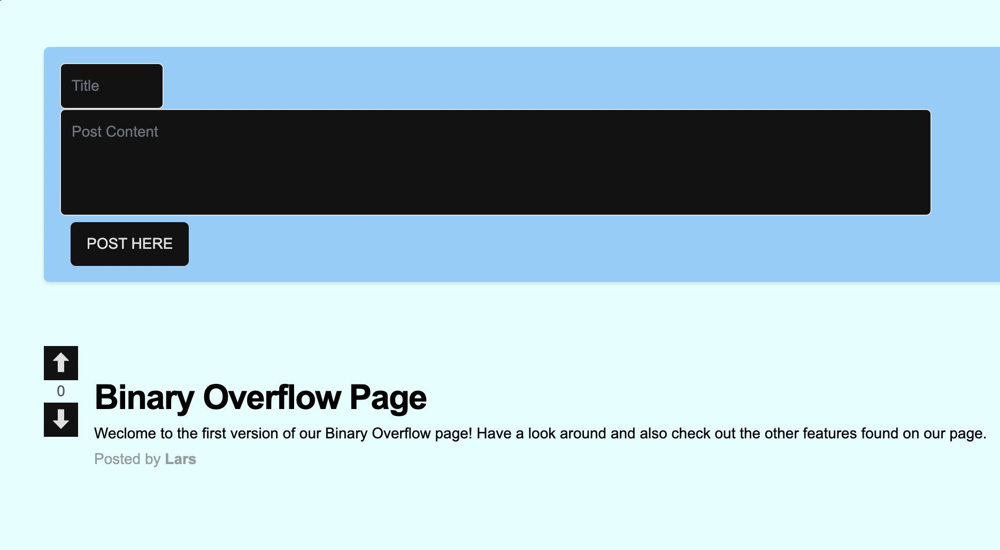
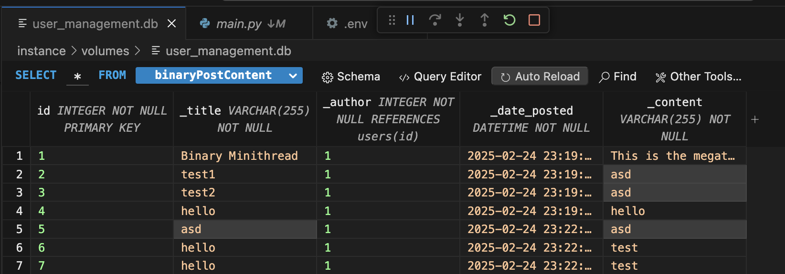
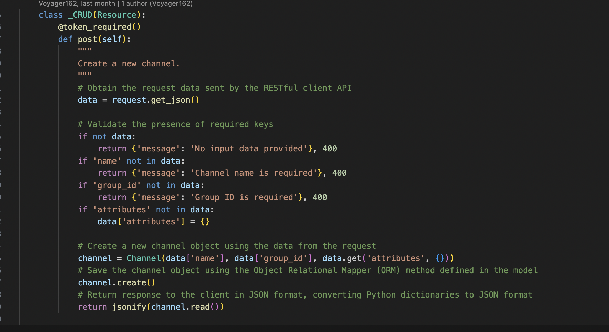
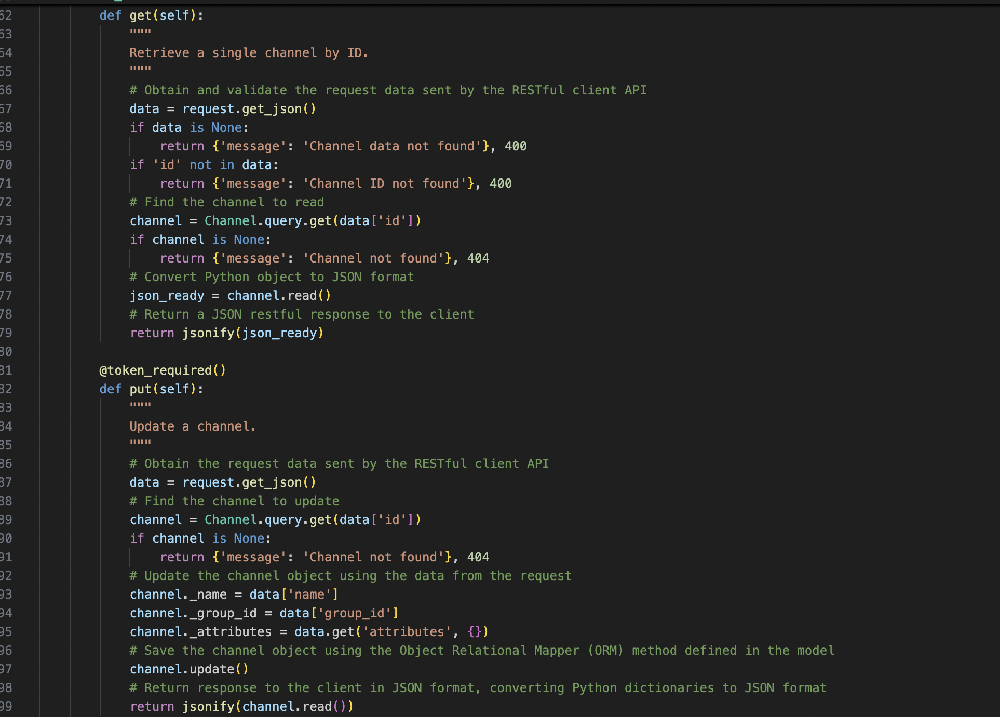
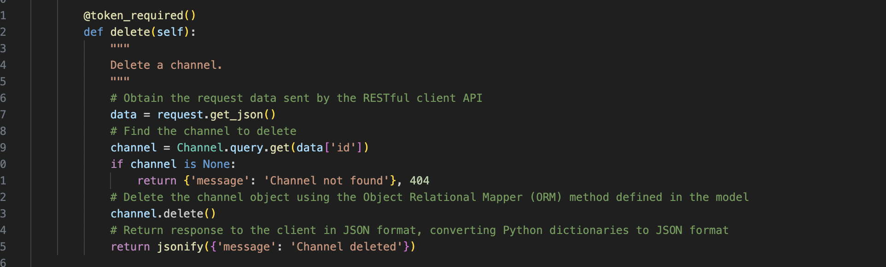

<body>
    <h1>Project Summary</h1>

        <h2>5 Points - 12 Week Progress Overview</h2>
        <button class="toggle-btn" onclick="toggleSection('progress')">See More</button>
        

            <h3>Five Things Accomplished</h3>
            <ul>
                <li>
                    <button class="toggle-btn" onclick="toggleSection('binaryCalcFrontend')">Binary Calculator Frontend</button>
                    

                        
Developing the Binary Calculator frontend allowed me to demonstrate my skills in web development, particularly in HTML, CSS, and JavaScript. By creating a user-friendly interface that accepts binary input and displays results, I was able to show that I can design interactive programs that meet user needs. It helped me understand the importance of user experience and the role it plays in the functionality of a program.

                    

                </li>
                <li>
                    <button class="toggle-btn" onclick="toggleSection('binaryOverflow')">Binary Overflow</button>
                    

                        

                    

                </li>
                <li>
                    <button class="toggle-btn" onclick="toggleSection('frontendReviewSite')">Developed Stylish Frontend for Binary Review Site</button>
                    

                        
By developing the frontend for the Binary Review Site, I was able to apply design principles and improve my ability to create engaging, functional web pages. I learned how to implement responsive design to ensure that the site would work well on different devices. The collaboration I did with Shaurya was also essential in helping me grow. It helped me understand the impact of a well-designed frontend on user experience and the effectiveness of a website or application.

                    

                </li>
                <li>
                    <button class="toggle-btn" onclick="toggleSection('binaryCalcBackend')">Developed Binary Calculator Backend</button>
                    

                        
Details about Binary Calculator Backend development...

                    

                </li>
                <li>
                    <button class="toggle-btn" onclick="toggleSection('collaborationSkills')">Improved Collaboration Skills through 8-Person Group Project</button>
                    

                        
Details about collaboration in the 8-person group project...

                    

                </li>
            </ul>
        

    

        <h2>2 Points - Full Stack Project Demo</h2>
        <button class="toggle-btn" onclick="toggleSection('demo')">See More</button>
        

            <h3>CPT Requirement Highlights</h3>
            

            <h3>N@tM Feedback</h3>
            

        

    

        <h2>1 Point - Project Feature Blog Write-Up</h2>
        <button class="toggle-btn" onclick="toggleSection('blog')">See More</button>
        

            

                The <strong>Binary Overflow</strong> feature, inspired by Stack Overflow, allows users to collaborate, post, and discuss other features on our group’s website, fostering a shared knowledge base for problem-solving and innovation.
                I met the <strong>CPT</strong> requirements by demonstrating <strong>program development, algorithm implementation, and user interaction</strong>.
            

            

                Specifically, it required <strong>designing and implementing a program</strong> that enables users to submit posts, categorize discussions, and respond to others.
            

            
            

                The feature utilizes <strong>data abstraction</strong>, through the use of databases, to manage user-generated content and track interactions.
            

            
            

                Additionally, it demonstrates <strong>procedural abstraction</strong> by breaking down tasks into reusable functions that handle posting, retrieving, and moderating discussions.
            

            
            
            
            

                The creation process also involved <strong>testing and debugging</strong>, ensuring smooth functionality and user experience. Finally, it meets the requirement of including a <strong>written explanation</strong> by allowing for detailed documentation of how the feature works, the problems solved during development, and how it enhances the overall website.
            

        

    

        <h2>1 Point - MCQ</h2>
        <button class="toggle-btn" onclick="toggleSection('mcq')">See More</button>
        

            
<strong>Question:</strong>

            <ul>
                <li>A. </li>
                <li>B. </li>
                <li>C. </li>
                <li>D. </li>
            </ul>
            
<strong>Answer:</strong>

        

    

</body>
